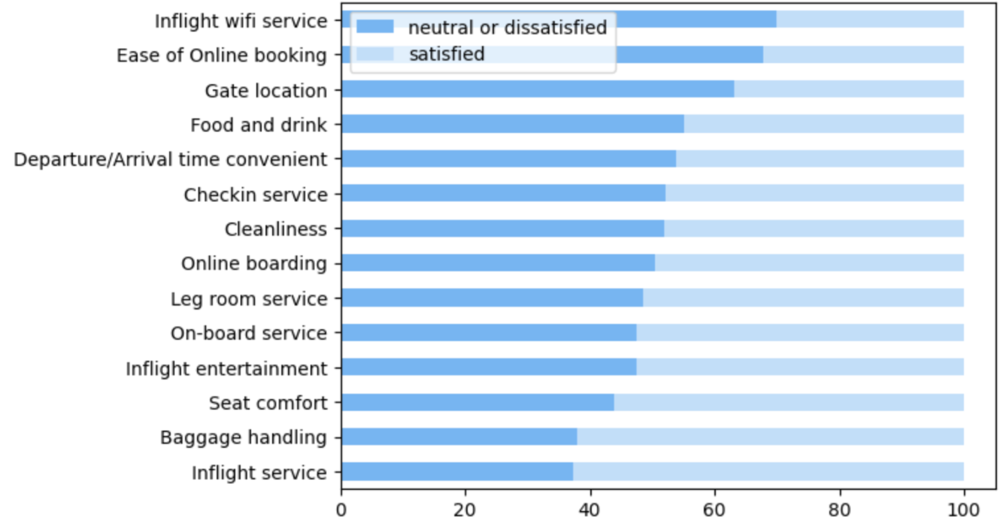
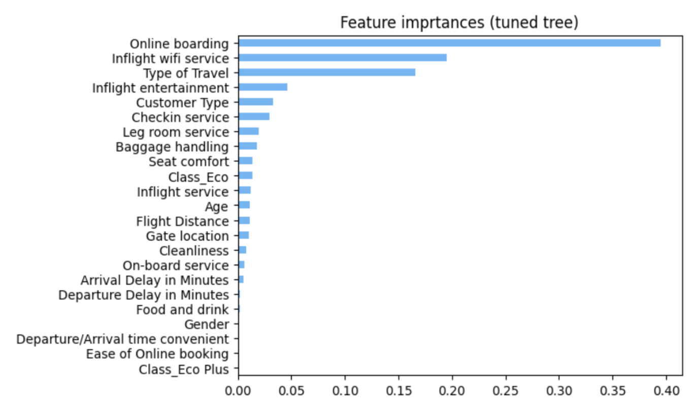

# predicting_customer_satisfaction

## Overview
This project aimed to build a model predicting 
customer satisfaction with an airline’s services 
using passenger survey data. The goal was to 
identify key factors influencing satisfaction and 
provide clear, actionable insights to the airline.
A decision tree model was chosen for its 
interpretability, allowing the marketing 
department to understand how the model makes 
decisions. The analysis included exploratory data 
analysis, data preparation, model building, and 
hyperparameter tuning.
## Data Understanding
The analysis used training and testing datasets 
with 25 columns, including customer demographics,
flight details, and satisfaction ratings for 
various services. The training dataset contained 
103,904 rows, and the testing dataset had 25,976 
rows. Key variables included ‘Gender,’ ‘Customer 
Type,’ ‘Age,’ ‘Type of Travel,’ ‘Class,’ ‘Flight 
Distance,’ and satisfaction ratings for services 
like ‘Inflight wifi service’ and ‘Seat comfort’. 
The target variable was ‘satisfaction,’ indicating 
whether customers were satisfied or not.

*The ratio of satisfied and dissatisfied customers for different services*
## Modeling and Evaluation
A decision tree model was built and evaluated, 
with hyperparameter tuning performed to optimize 
performance and prevent overfitting. The model's 
performance was assessed using metrics such as 
accuracy, precision, recall, and the F1 score. 
The tuned model achieved an accuracy of 94.7% on 
the testing data, with a precision of 94.9%, 
recall of 93.1%, and an F1 score of 93.9%.

*Feature importances of the tuned tree*
## Conclusion
The decision tree model effectively predicts 
customer satisfaction, identifying ‘Online 
boarding,’ ‘Inflight wifi service,’ and 
‘Type of Travel’ as key influencing factors. 
The analysis revealed that customers are generally
less satisfied with inflight Wi-Fi, online 
booking ease, and gate location. 
Recommendations include focusing on 
improvements in these areas and prioritizing 
the satisfaction of personal travel and Eco class
passengers.